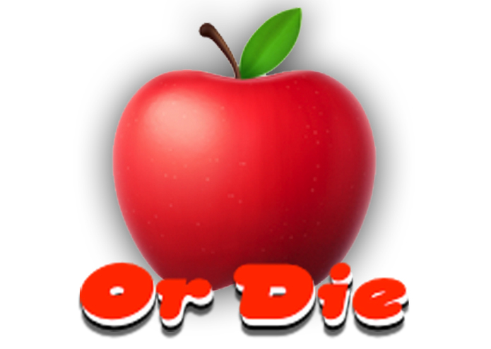

# Apple Or Die  App

## What is this project about? 🤔

Discover how easy and fun it is to eat different fruits on every single day of the week!

Choose a fun challenge like this one:

>"You have one week to eat an apple 🍎, a pineapple 🍍, a banana  🍌, a pear 🍐 and an orange 🍊. Each day 📆 you choose 👇 one of these fruits, take a picture 📸 of them with our App 📱 and eat 🍽 it afterwards."

Challenge yourself with different scenarios in which you have to eat a different type of truit every day! An internal artificial intelligence will verify whether you cheated or not! Go break that fruit streak! 🎉

## How to use the App? 🤩

1. Pick a scenario.
2. Before you eat your delicious fruit, open up the *Apple or Die* App and take a picture of it with your phone. It internally uses the machine learning algorithms to recognize the fruit.

  

3. If your task was to eat a banana 🍌 today, and you indeed at a banana, then the day is checked off for you! ✅

## Technologies used 👩🏽‍💻

* 👩🏻‍🔬[Google Vision API](https://cloud.google.com/vision/): Machine learning algorithms to detect objects in images.
* 📲 [React Native](https://facebook.github.io/react-native/): A mobile app framework to create native iOS and Android apps.